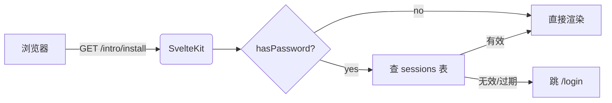

# Mermaid 与代码块

## Mermaid 流程图



## 时序图

```mermaid
sequenceDiagram
    participant U as 用户
    participant Z as zdoc
    participant D as SQLite
    U->>Z: POST /login (password)
    Z->>D: INSERT sessions (token_hash, epoch, expires_at)
    Z-->>U: Set-Cookie docs_session; 303
    U->>Z: GET /intro/install (Cookie)
    Z->>D: SELECT sessions WHERE token_hash
    D-->>Z: row
    Z-->>U: 200 HTML
```

## 代码高亮

```ts
import Database from 'better-sqlite3';

const db = new Database('zdoc.db');
db.exec('PRAGMA journal_mode = WAL');
db.prepare('INSERT INTO sessions VALUES (?, ?, ?)').run(hash, epoch, expiresAt);
```

```bash
bun run dev:demo
# Local:   http://localhost:5173
```

```json
{
  "title": "我的文档",
  "docsDir": "./docs",
  "password": "hunter2",
  "port": 8888
}
```

## 行内 `code`

正文里一样能 `inline code`，比如 `_meta.yaml` 或者 `const x = 1`。
