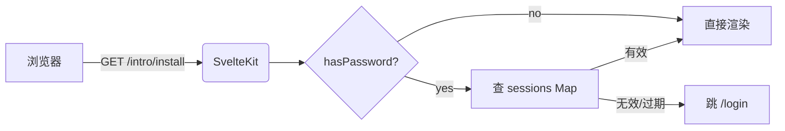
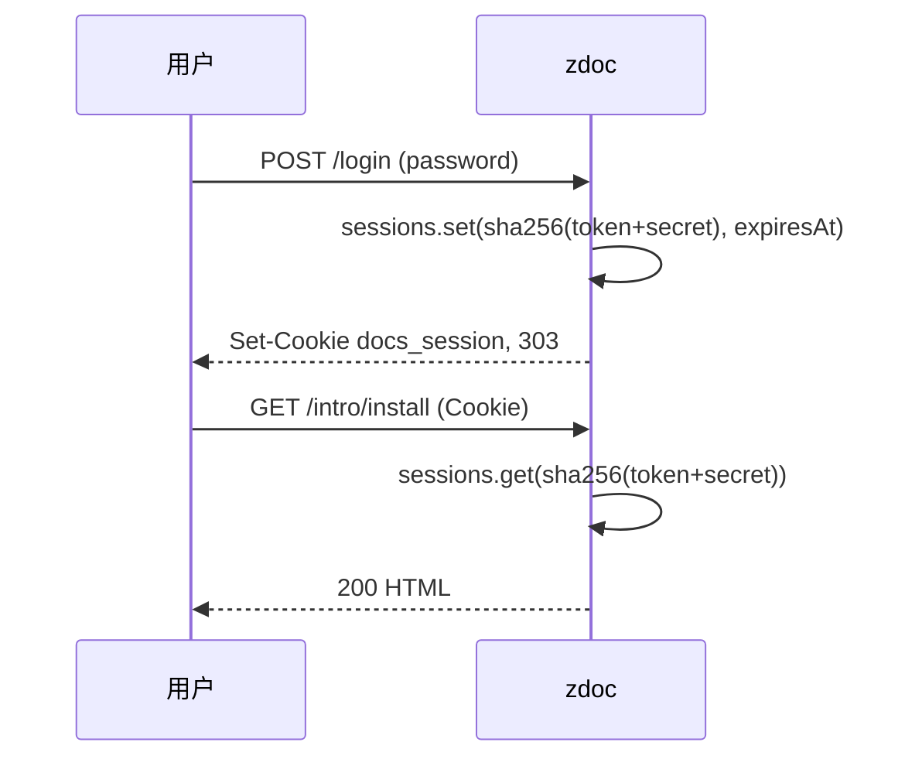
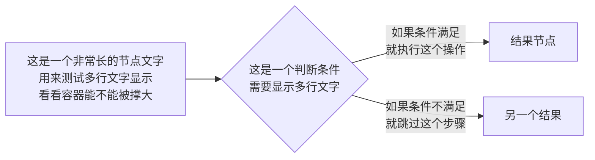

# Mermaid 与代码块

## Mermaid 流程图



## 时序图



## 多行标签测试



## 代码高亮

```ts
const sessions = new Map<string, number>();
const hash = sha256(token + secret);
sessions.set(hash, Date.now() + 7 * 24 * 3600 * 1000);
```

```bash
bun run dev
# Local:   http://localhost:5173
```

```json
{
  "title": "我的文档",
  "docsDir": "./docs",
  "password": "hunter2",
  "port": 8888
}
```

## 行内 `code`

正文里一样能 `inline code`，比如 `_meta.yaml` 或者 `const x = 1`。
