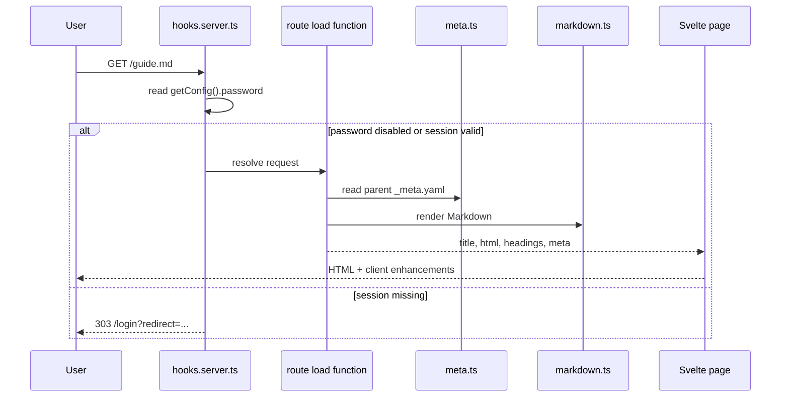

`zdoc` is a small system, but the flow is opinionated: the CLI establishes process-wide config, SvelteKit route loaders read from the docs directory, and the renderer turns Markdown into HTML only for files that `_meta.yaml` exposes.

```mermaid
graph TD
  A[bin/cli.ts] --> B[Environment variables]
  B --> C[src/lib/config.ts]
  C --> D[src/routes/+layout.server.ts]
  C --> E[src/routes/+page.server.ts]
  C --> F[src/routes/[...path]/+page.server.ts]
  D --> G[src/lib/sidebar.ts]
  G --> H[src/lib/meta.ts]
  E --> I[src/lib/markdown.ts]
  F --> H
  F --> I
  F --> J[src/routes/api/pdf/[...path]/+server.ts]
  K[src/hooks.server.ts] --> C
  K --> L[src/lib/sessions.ts]
```

## Module Roles

- `bin/cli.ts` is the only package entry point. It parses flags, reads `zdoc.config.json` from the current working directory, probes for a free port, sets `ZDOC_DIR`, `ZDOC_PASSWORD`, `ZDOC_TITLE`, `PORT`, and `HOST`, then imports `build/index.js`.
- `src/lib/config.ts` snapshots configuration once at module load. Every server module reads that singleton through `getConfig()`.
- `src/lib/meta.ts` provides the custom YAML reader used for `_meta.yaml`. It is intentionally narrow: nested object maps work, but YAML sequences are not part of the parser.
- `src/lib/sidebar.ts` walks the filesystem and turns directory metadata plus page metadata into a nested `SidebarGroup[]`.
- `src/lib/markdown.ts` is the render pipeline. It strips top-level frontmatter, extracts Mermaid blocks, runs Remark and Rehype, collects `h1` to `h3`, and wraps code blocks with copy controls.
- `src/hooks.server.ts` is the authentication gate. If `password` is non-empty, every request except the login POST or login page is checked for a valid `docs_session` cookie.
- `src/routes/+page.server.ts`, `src/routes/[...path]/+page.server.ts`, and `src/routes/api/pdf/[...path]/+server.ts` are the content loaders.

## Key Design Decisions

### Configuration is process-global

`src/lib/config.ts` computes `state` once:

```ts
const state: DocsConfig = loadConfig();
```

That keeps downstream code simple because no loader needs to thread config through function arguments. The trade-off is that changing `zdoc.config.json` while the server is running does nothing; restarting the process is the only refresh path.

### Navigation is opt-in, not inferred

`src/lib/sidebar.ts` never exposes every `.md` file automatically. It reads `_meta.yaml`, then only emits links for entries under `pages` that have a `title`. This prevents drafts from leaking into the UI, but it also means a file can exist on disk and still return `404` if the corresponding key is missing.

### Route safety is enforced at file resolution time

`src/routes/[...path]/+page.server.ts` and `src/routes/api/pdf/[...path]/+server.ts` use `resolve(root, slug)` plus a prefix check against `root + sep`. That is the project’s path traversal guard. The route loader still trusts `_meta.yaml` for visibility, so being inside the root is necessary but not sufficient for a page to render.

### Mermaid stays client-side

The Markdown renderer intentionally replaces fenced Mermaid blocks with `<pre class="mermaid">` placeholders. `src/routes/[...path]/+page.svelte` then imports `mermaid` in the browser and swaps each block for generated SVG. That keeps the server runtime lighter and avoids doing SVG generation during request handling.

## Request Lifecycle



## How The Pieces Fit Together

The home page is special. `src/routes/+page.server.ts` reads only `index.md` at the docs root, peels off a small hero frontmatter subset with regular expressions, and renders the remaining Markdown body. Every other content page goes through `src/routes/[...path]/+page.server.ts`, which first checks whether the request ends in `.md` or `.pdf`. Markdown pages call `renderMarkdown()`, while PDFs are delegated to `/api/pdf/...` and embedded with an `iframe`.

This split explains several externally visible behaviors:

- Landing-page hero data is only supported on the root `index.md`.
- Per-page description, version, author, and modified metadata come from `_meta.yaml`, not Markdown frontmatter.
- Internal routes keep file suffixes because the file loader’s first branch is suffix-based.
- PDF visibility depends on both the file existing and the parent `_meta.yaml` including the exact filename key.

For implementation details behind each part of the flow, continue with [CLI Bootstrap](/docs/cli-bootstrap), [Metadata-Driven Navigation](/docs/metadata-driven-navigation), and [Auth and Routing](/docs/auth-and-routing).
