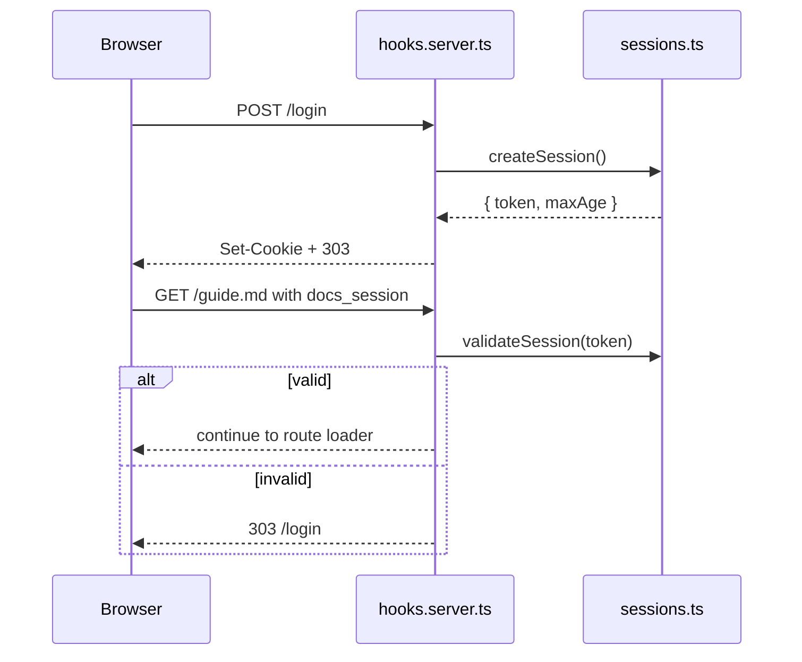

The runtime behavior users notice most after startup is request handling: login redirects, route resolution, and PDF delivery.

## What It Is

Authentication lives in `src/hooks.server.ts`, session storage lives in `src/lib/sessions.ts`, and content routing lives in `src/routes/[...path]/+page.server.ts` plus `src/routes/api/pdf/[...path]/+server.ts`.

## Why It Exists

zdoc is aimed at internal docs and small shared handbooks, where “one password for the whole site” is often enough. It also needs a safe way to expose arbitrary files from a docs directory without turning that directory into an unrestricted file server.

## How It Works Internally

When `getConfig().password` is empty, the hook simply calls `resolve(event)`. When a password is present:

1. `POST /login` compares `formData().get("password")` to the configured password.
2. On success, `createSession()` returns a random token and a max age.
3. The hook sets `docs_session=<token>` as an `HttpOnly` cookie and redirects to the requested page.
4. Every later request extracts the cookie with a regex and validates it through `validateSession(token)`.
5. If validation fails, the hook returns a `303` redirect to `/login?redirect=...`.



The session store is intentionally small:

```ts
const sessions = new Map<string, number>();
```

Tokens are hashed with a process-local secret before being stored, and expired entries are lazily pruned. Because the secret is randomly generated at boot, all sessions become invalid when the process restarts.

Routing is equally explicit. `src/routes/[...path]/+page.server.ts` only serves:

- `*.pdf` requests declared in the parent `_meta.yaml`
- `*.md` requests declared in the parent `_meta.yaml`

The loader uses `safeJoin(root, slug)` to reject `..` path traversal. PDFs are then streamed by `/api/pdf/...`, while Markdown files are rendered directly.

## How It Relates To Other Concepts

- [CLI Bootstrap](/docs/cli-bootstrap) decides whether auth is enabled by setting `password`.
- [Metadata-Driven Navigation](/docs/metadata-driven-navigation) decides which files are visible after routing has found them.
- [Markdown Pipeline](/docs/markdown-pipeline) only runs for approved `.md` files.

## Basic Example

Protect a site with one shared password:

```bash
zdoc -d ./docs -w hunter2
```

After a successful login, the browser receives a `docs_session` cookie and can browse the site until the 7-day TTL expires or the process restarts.

## Advanced Example

Mix Markdown and PDF routes in one section:

```yaml
title: Reports
pages:
  release-notes:
    title: Release Notes
  q2-report.pdf:
    title: Q2 Report
```

Files:

```text
reports/
├── _meta.yaml
├── release-notes.md
└── q2-report.pdf
```

The Markdown page is opened at `/reports/release-notes.md`. The PDF page is opened at `/reports/q2-report.pdf`, which renders an `iframe` pointing at `/api/pdf/reports/q2-report.pdf`.

<Callout type="warn">The current implementation routes child pages with `.md` and `.pdf` suffixes intact. The code path in `src/routes/[...path]/+page.server.ts` rejects suffixless document URLs, and `src/lib/sidebar.ts` builds links from actual filenames. Write internal links accordingly.</Callout>

<Accordions>
<Accordion title="Why sessions are in memory instead of persisted">
The in-memory `Map` in `src/lib/sessions.ts` keeps installation simple and avoids native dependencies or external services. That matches the project’s focus on quick local or internal deployment. The trade-off is operational durability: server restarts log everyone out, horizontal scaling would require sticky sessions or a shared store, and there is no administrative way to inspect or revoke sessions other than restarting. For a small docs server, that trade is coherent, but it is a deliberate limit.
</Accordion>
<Accordion title="Why route loaders require metadata approval as well as file existence">
Checking only the filesystem would make the site harder to curate and easier to misconfigure. By requiring a matching `_meta.yaml` entry, zdoc keeps the sidebar and routable surface in lockstep, which is important for documentation teams that stage drafts alongside published pages. The downside is that moving or renaming files without updating metadata creates hard 404s that can look surprising at first. In practice, the explicitness is useful because missing metadata is easier to review in Git than accidental auto-discovery.
</Accordion>
</Accordions>
