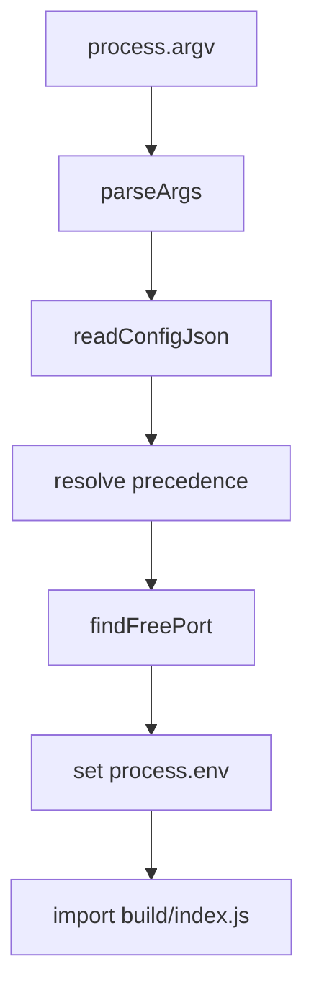

The CLI bootstrap path is the first concept to understand because the rest of the app assumes process-level configuration has already been resolved. Everything starts in `bin/cli.ts`.

## What It Is

`bin/cli.ts` is the package’s public interface. The executable accepts a docs directory, port, password, and title, then sets environment variables that the SvelteKit server reads later through `src/lib/config.ts`.

## Why It Exists

The project is deliberately a CLI rather than a reusable rendering library. That choice avoids exposing a broad JavaScript API and keeps setup to a single command:

```bash
npx @o7z/zdoc -d ./docs
```

For a repeatable setup, pair the command with `zdoc.config.json`:

```json
{
  "title": "Engineering Docs",
  "docsDir": "./docs",
  "password": "",
  "port": 8888
}
```

## How It Works Internally

`parseArgs(argv)` in `bin/cli.ts` scans the raw argument list and tracks whether each field was explicitly set. That extra bookkeeping matters because precedence is not a simple merge; the code needs to know whether a flag was omitted or intentionally set to an empty string.

After parsing:

1. `readConfigJson(process.cwd())` attempts to load `zdoc.config.json`.
2. `docsDir`, `port`, `password`, and `title` are resolved with CLI overrides first.
3. `findFreePort(startPort)` opens a temporary `node:net` server and increments until a port binds cleanly.
4. The CLI writes `ZDOC_DIR`, `ZDOC_PASSWORD`, `ZDOC_TITLE`, `PORT`, and `HOST`.
5. It imports `build/index.js`, which starts the compiled SvelteKit server.



The runtime config module mirrors this by loading once:

```ts
export function getConfig(): DocsConfig {
  return state;
}
```

That means every server-side caller sees a stable snapshot.

## How It Relates To Other Concepts

- [Metadata-Driven Navigation](/docs/metadata-driven-navigation) depends on `getConfig().docsDir`.
- [Auth and Routing](/docs/auth-and-routing) depends on `getConfig().password`.
- The API reference for the exact CLI contract is in [CLI](/docs/api-reference/cli) and [Config](/docs/api-reference/config).

## Basic Example

Serve the current folder publicly:

```bash
zdoc
```

This uses the defaults in `DEFAULTS` from `bin/cli.ts`:

- `dir`: `process.cwd()`
- `port`: `8888`
- `password`: `""`
- `title`: `"Docs"`

## Advanced Example

Combine a config file with a targeted override:

```json title="zdoc.config.json"
{
  "title": "Platform Docs",
  "docsDir": "./handbook",
  "password": "internal-only",
  "port": 9000
}
```

```bash
zdoc --port 9100 --password ""
```

That launch still uses `./handbook` and `Platform Docs`, but it binds to port `9100` and disables auth because `--password ""` is treated as an explicit override.

<Callout type="warn">`zdoc.config.json` is read from the current working directory, not from the docs directory. Running `zdoc` from a different folder can change which config file is applied even if `--dir` points at the same docs tree.</Callout>

<Accordions>
<Accordion title="Why a singleton config state was chosen">
The singleton in `src/lib/config.ts` removes repeated filesystem reads from every request path. That keeps the route loaders cheap and predictable, especially because sidebar generation and Markdown rendering already do synchronous disk reads. The cost is operational rather than computational: there is no live reload for config, and changing `zdoc.config.json` mid-process has no effect. If you need runtime mutability, you would have to replace the module-level `state` with request-time reads or a watcher-driven cache, which would complicate every consumer.
</Accordion>
<Accordion title="Why port auto-increment is convenient and where it can surprise you">
`findFreePort()` improves the out-of-box experience because the CLI still starts when `8888` is already in use. That is particularly useful in local development where stale processes are common. The downside is that external tooling may assume the requested port is guaranteed; if you have a reverse proxy, browser bookmark, or Docker health check pinned to a specific port, silent fallback can hide misconfiguration. In those cases, check the startup output and treat the printed `Local` URL as the source of truth.
</Accordion>
</Accordions>
