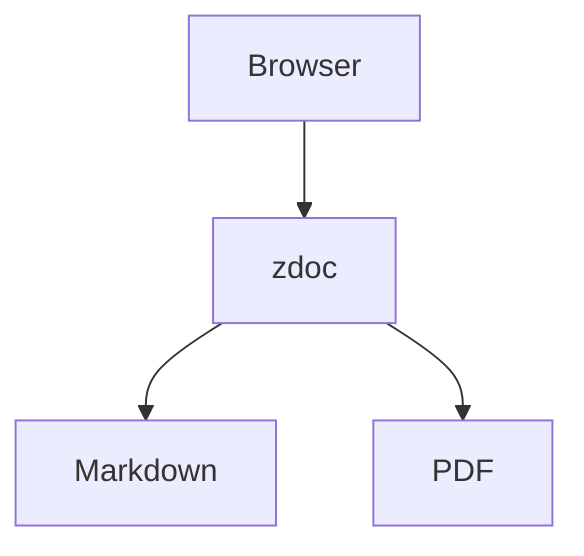

This guide shows how to combine Markdown, Mermaid diagrams, and static PDFs in a single zdoc site.

## Problem

Technical docs often need both narrative pages and attached artifacts such as architecture PDFs, spec exports, or release reports. Managing those in separate systems makes navigation messy.

## Solution

Keep everything in one docs directory. Author diagrams directly in Markdown with fenced Mermaid blocks, and list PDFs in `_meta.yaml` using their full filenames.

<Steps>
<Step>
### Create a section that mixes Markdown and PDFs

```text
docs/architecture/
├── _meta.yaml
├── overview.md
└── deployment.pdf
```

```yaml title="docs/architecture/_meta.yaml"
title: Architecture
order: 2

pages:
  overview:
    title: Overview
    order: 1
    description: System topology and data flow
  deployment.pdf:
    title: Deployment PDF
    order: 2
```

</Step>
<Step>
### Add Mermaid to the Markdown page

````md title="docs/architecture/overview.md"
# Architecture Overview



The same page can also include normal code blocks:

```ts
console.log("zdoc renders this with syntax highlighting");
```
````

</Step>
<Step>
### Run the site and open both routes

```bash
npx @o7z/zdoc -d ./docs
```

Visit:

```text
/architecture/overview.md
/architecture/deployment.pdf
```

</Step>
</Steps>

What happens internally:

- `src/lib/markdown.ts` replaces the Mermaid fence with a placeholder and emits normal HTML for the rest of the page.
- `src/routes/[...path]/+page.svelte` imports `mermaid` in the browser and replaces the placeholder with SVG.
- `src/routes/api/pdf/[...path]/+server.ts` streams the PDF bytes with `Content-Type: application/pdf`.
- The PDF page route embeds that API endpoint inside an `iframe`.

This pattern works well for release engineering, architecture reviews, and compliance docs because the sidebar treats both page types consistently. The only metadata difference is that a PDF key in `_meta.yaml` must include the full filename, while a Markdown key omits `.md`.

If you need a visible summary above the PDF or Markdown content, add `description`, `version`, `author`, or `modified` to the `_meta.yaml` entry. Those fields are extracted in `src/routes/[...path]/+page.server.ts` and rendered as the metadata bar in `src/routes/[...path]/+page.svelte`.
