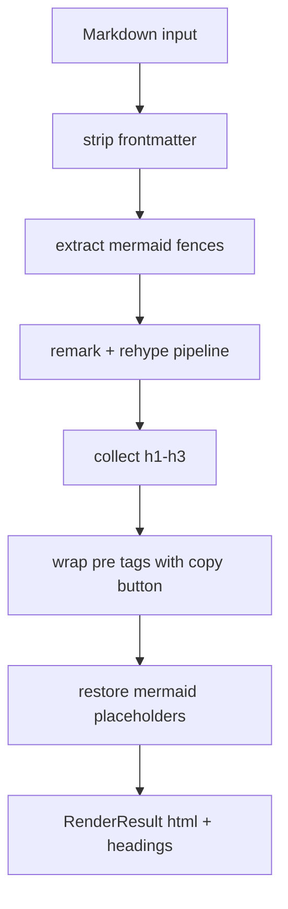
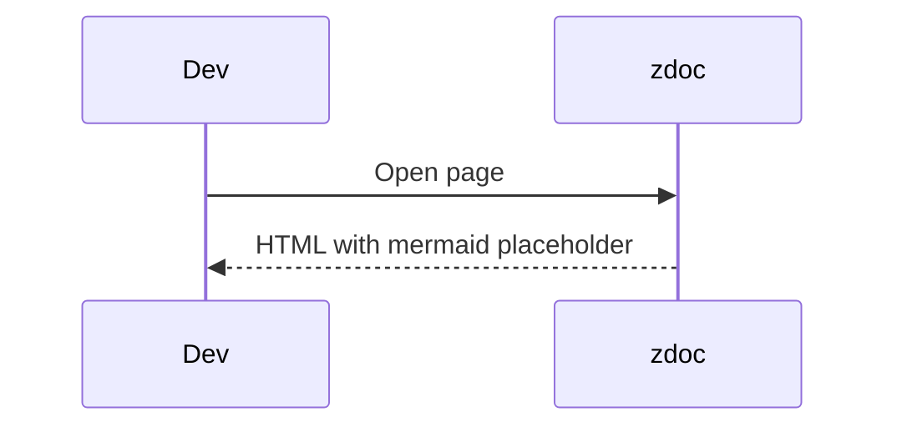

Rendering in zdoc is split between a server-side Markdown pipeline and a small amount of client-side enhancement.

## What It Is

The core renderer lives in `src/lib/markdown.ts`. It accepts a Markdown string and returns:

```ts
interface RenderResult {
  html: string;
  headings: Heading[];
}
```

The route loaders feed that result into Svelte components that add the table of contents, Mermaid rendering, and copy-to-clipboard buttons.

## Why It Exists

The project needs richer output than raw Markdown:

- syntax-highlighted code blocks
- stable heading IDs for a table of contents
- copy buttons on fenced code
- Mermaid diagrams without pre-rendering SVG on the server

At the same time, the authoring experience stays plain Markdown.

## How It Works Internally

`renderMarkdown(md)` performs these steps:

1. Strip the first frontmatter block with `md.replace(/^---
[\s\S]*?
---
/, '')`.
2. Replace every fenced Mermaid block with a placeholder string and store the diagram source separately.
3. Run a Unified pipeline with `remark-parse`, `remark-gfm`, `remark-rehype`, `rehype-slug`, `rehype-highlight`, the custom `collectHeadings` plugin, the custom `rehypeCodeCopy` plugin, and `rehype-stringify`.
4. Replace placeholder paragraphs with `<pre class="mermaid">...</pre>`.



The page component in `src/routes/[...path]/+page.svelte` then imports `mermaid` on mount and swaps every `pre.mermaid` block for generated SVG. It also sets up a scroll spy against the rendered headings to highlight the active TOC entry.

The root landing page has its own path. `src/routes/+page.server.ts` parses `index.md`, looks for a narrow hero frontmatter subset using regular expressions, renders the remainder as Markdown, and returns `hero` data plus `html`.

## How It Relates To Other Concepts

- `_meta.yaml` decides whether a page is visible; the Markdown pipeline only runs after the route loader has approved the file.
- Auth wraps the entire request before any rendering happens.
- The API surface for the renderer is in [Markdown](/docs/api-reference/markdown).

## Basic Example

Author a diagram and a code block in one page:

````md
# Deploy Flow



```ts
const result = await renderMarkdown("# Hello");
console.log(result.headings);
```
````

The server returns HTML immediately, and the Mermaid block becomes SVG after the browser runs `initMermaid()`.

## Advanced Example

Use a root landing page with hero metadata:

````md
---
name: API Handbook
text: Internal docs for the platform team
tagline: Searchable, password-protected, and Git-friendly.
actions:
  - theme: brand
    text: Start here
    link: /intro.md
features:
  - title: Plain Markdown
    details: Content stays in the repo.
---

# Welcome

This content renders below the hero.
````

This only works for the docs root `index.md`, because the regex-based hero extraction exists in `src/routes/+page.server.ts` and nowhere else.

<Callout type="warn">The home-page hero parser is not a general YAML frontmatter parser. It expects `name`, `text`, `tagline`, `actions`, and `features` in the multiline shapes matched by the regular expressions in `src/routes/+page.server.ts`. Reordering fields or using more complex YAML can silently drop hero data.</Callout>

<Accordions>
<Accordion title="Why Mermaid is rendered in the browser instead of during Markdown processing">
Client-side Mermaid keeps the server pipeline deterministic and fast, because the server only has to emit placeholder HTML. It also allows the page component to choose a Mermaid theme based on the current dark-mode class at render time. The cost is that diagrams appear after hydration rather than as fully server-rendered SVG, and any Mermaid syntax error only shows up in the browser console. If SEO or no-JavaScript rendering mattered more than simplicity, server-side diagram rendering would be a better fit.
</Accordion>
<Accordion title="Why the renderer only collects h1 to h3 headings">
The right-side table of contents is intentionally shallow. `collectHeadings` ignores `h4` and deeper headings, which keeps the TOC compact and the scroll spy logic straightforward. The trade-off is that very detailed documents lose some navigational detail in the sidebar. If your docs style relies on deep heading nesting, you would need to widen the `Heading.depth` union and update both the extractor and TOC component.
</Accordion>
</Accordions>
