# Mermaid 图表全集

zdoc 原生支持 Mermaid：用 ` ```mermaid ` 代码块即可渲染 SVG 图表。以下是 Mermaid 支持的所有主要图表类型。

## 流程图（Flowchart）

最常用的图表类型，适合展示流程、算法、决策树。

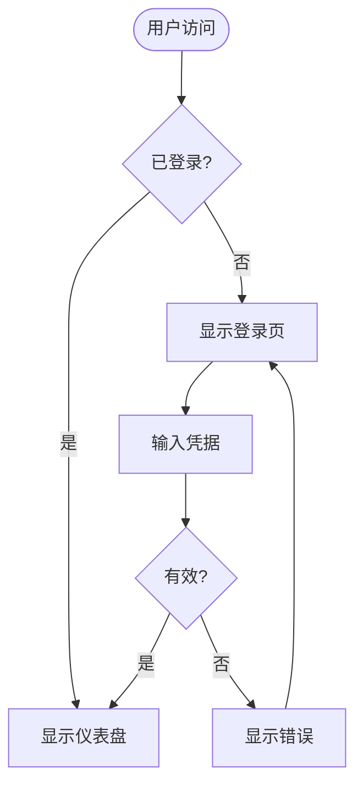

### 节点形状速查

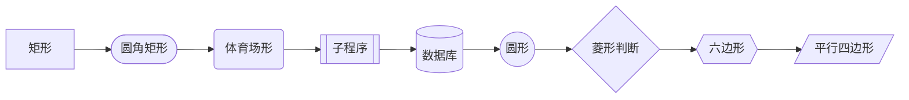

### 子图与方向

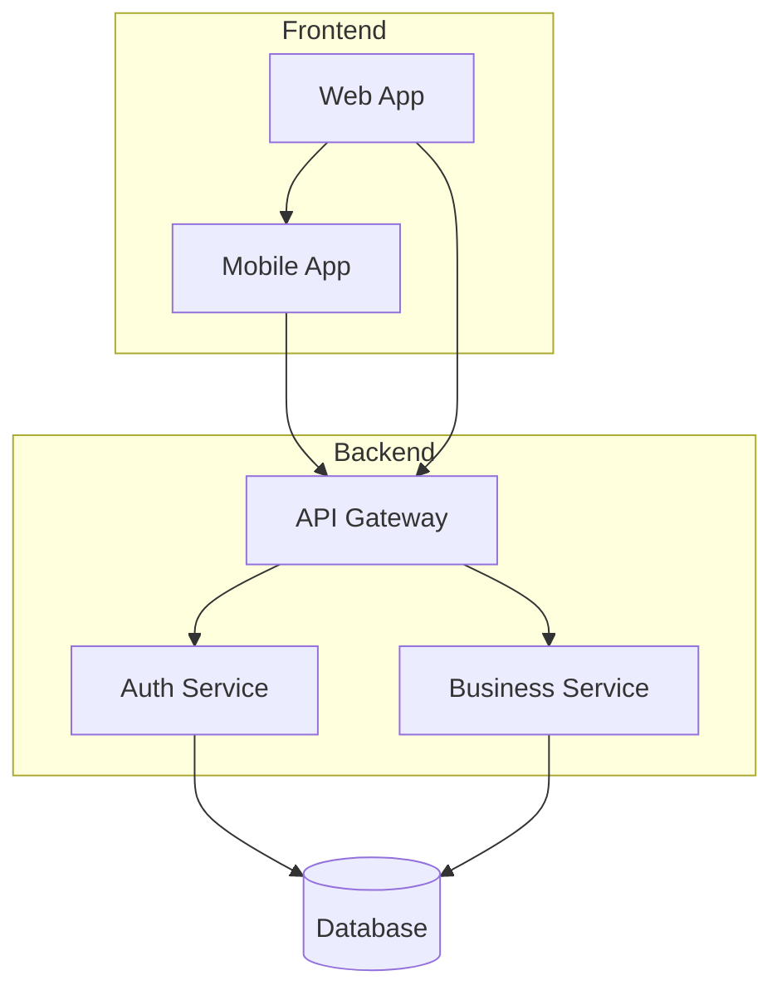

## 时序图（Sequence Diagram）

展示参与者之间的消息交互，适合 API 流程、认证过程。

```mermaid
sequenceDiagram
    autonumber
    actor User
    participant Frontend
    participant API
    participant DB

    User->>+Frontend: 点击登录
    Frontend->>+API: POST /auth/login
    API->>+DB: 查询用户
    DB-->>-API: 用户记录

    alt 密码正确
        API-->>Frontend: 200 + JWT
        Frontend-->>-User: 跳转仪表盘
    else 密码错误
        API-->>Frontend: 401
        Frontend-->>-User: 显示错误
    end
```

### 并行与循环

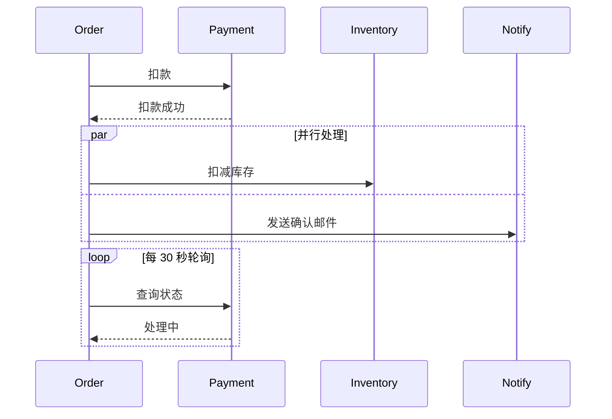

## 类图（Class Diagram）

面向对象设计、领域建模，展示类、属性、方法和关系。

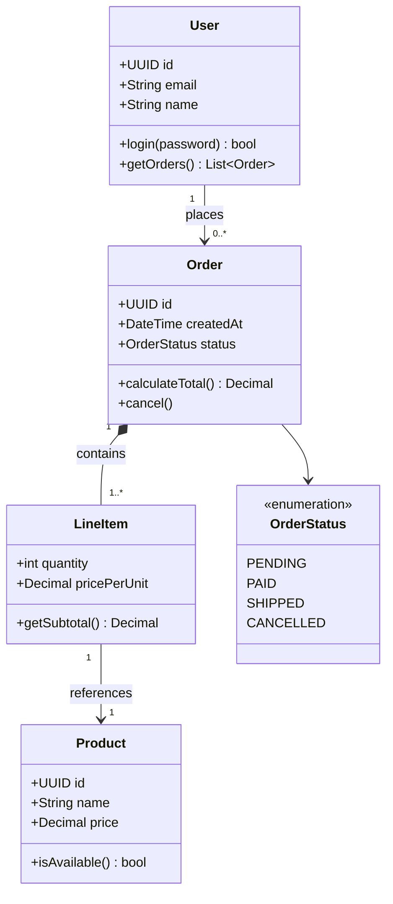

### 设计模式示例

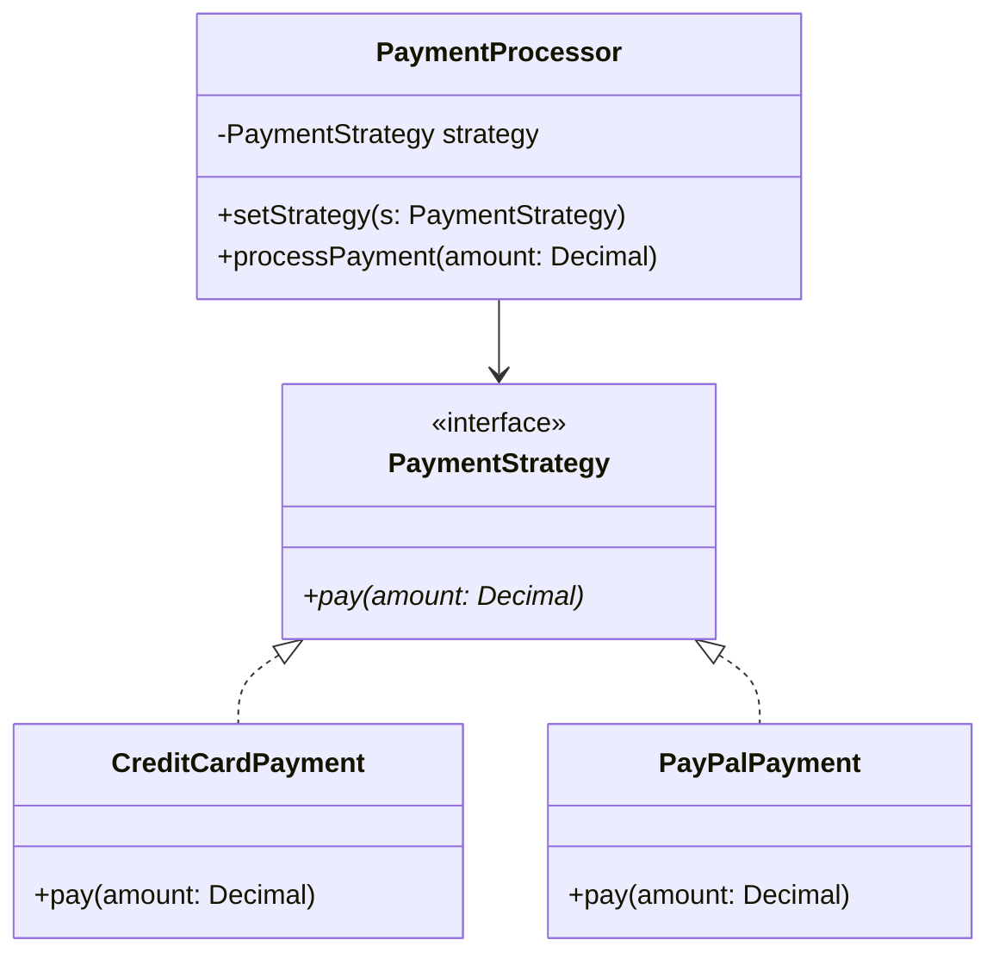

## ER 图（Entity Relationship Diagram）

数据库建模，展示表、字段和关系。

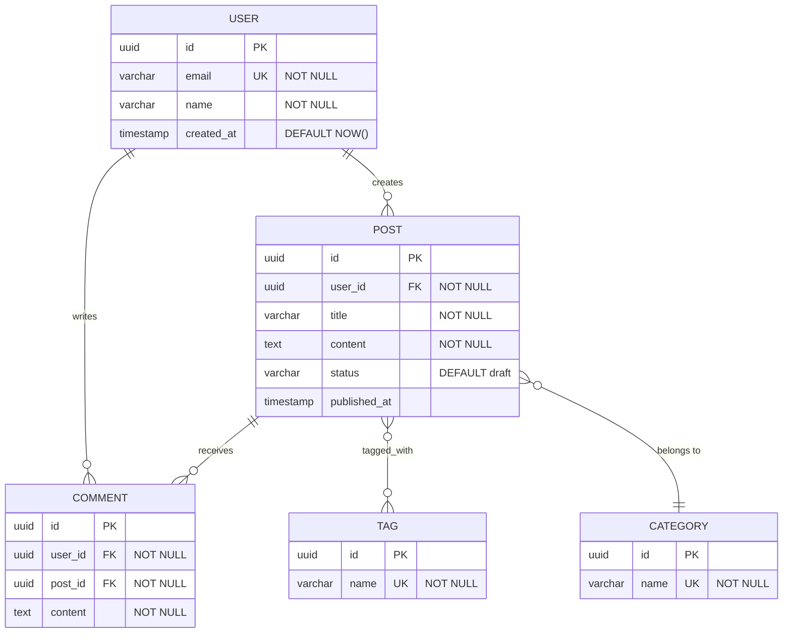

## 状态图（State Diagram）

状态机、生命周期、订单状态流转。

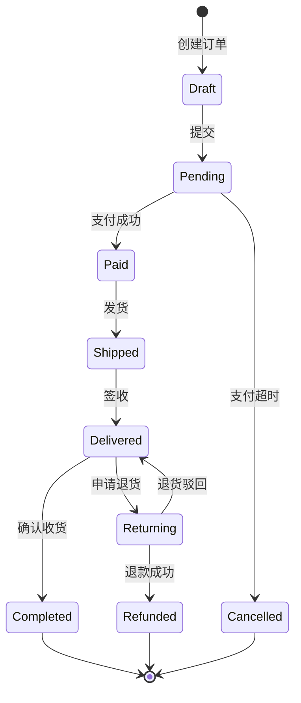

### 复合状态

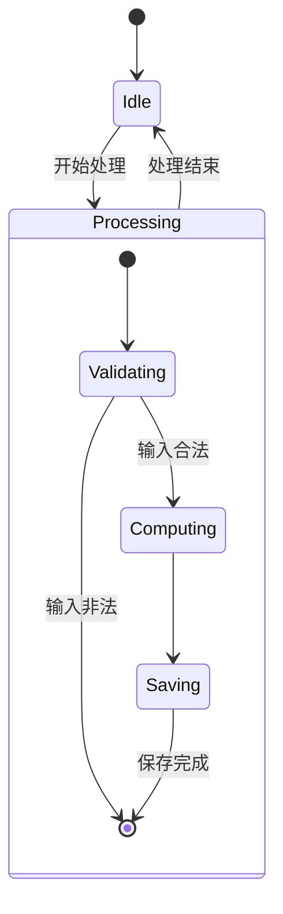

## 甘特图（Gantt Chart）

项目排期、里程碑、任务依赖。

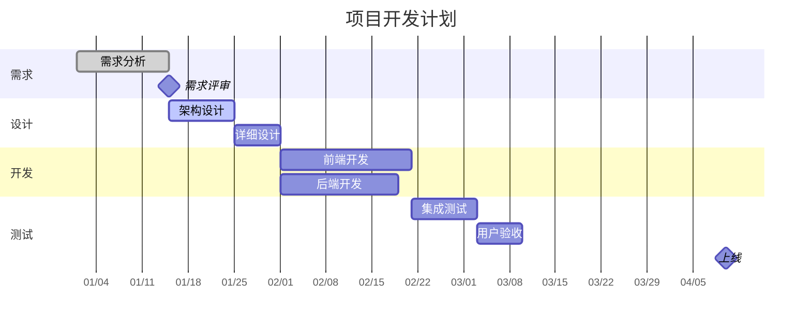

## 饼图（Pie Chart）

数据占比可视化。

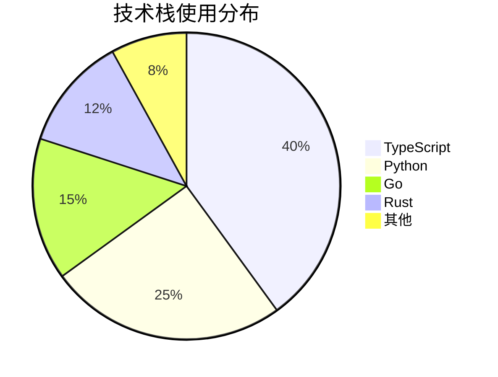

## Git 图（Git Graph）

分支策略、版本管理流程。

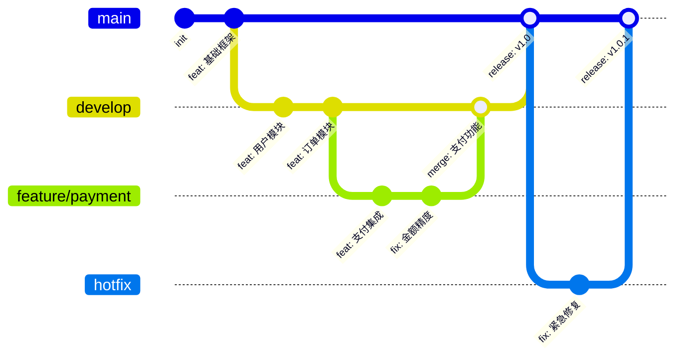

## 用户旅程图（User Journey）

用户体验地图，展示情绪变化。

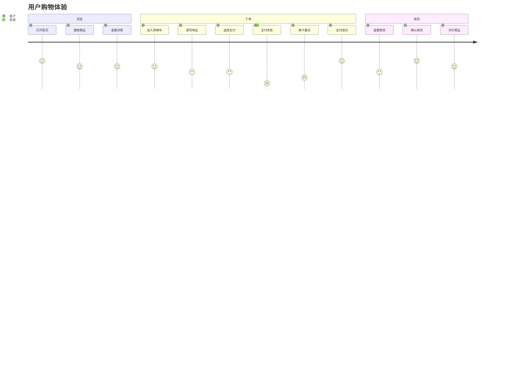

## 思维导图（Mindmap）

知识梳理、头脑风暴、层级结构。

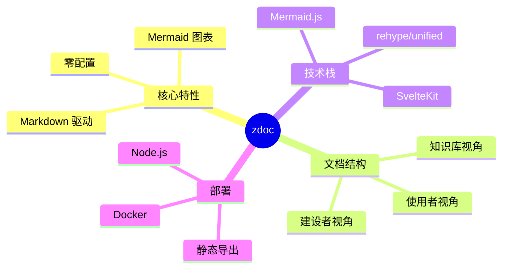

## 时间线（Timeline）

项目里程碑、事件演进。

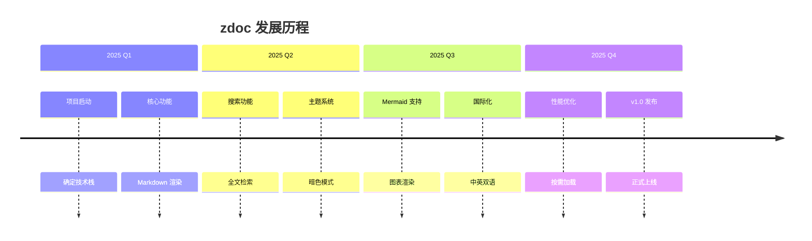

## 架构图（Architecture Diagram）

云服务、基础设施、部署架构（Mermaid v11.1+）。


## C4 模型（C4 Diagram）

分层架构可视化：系统上下文 → 容器 → 组件。

### 系统上下文

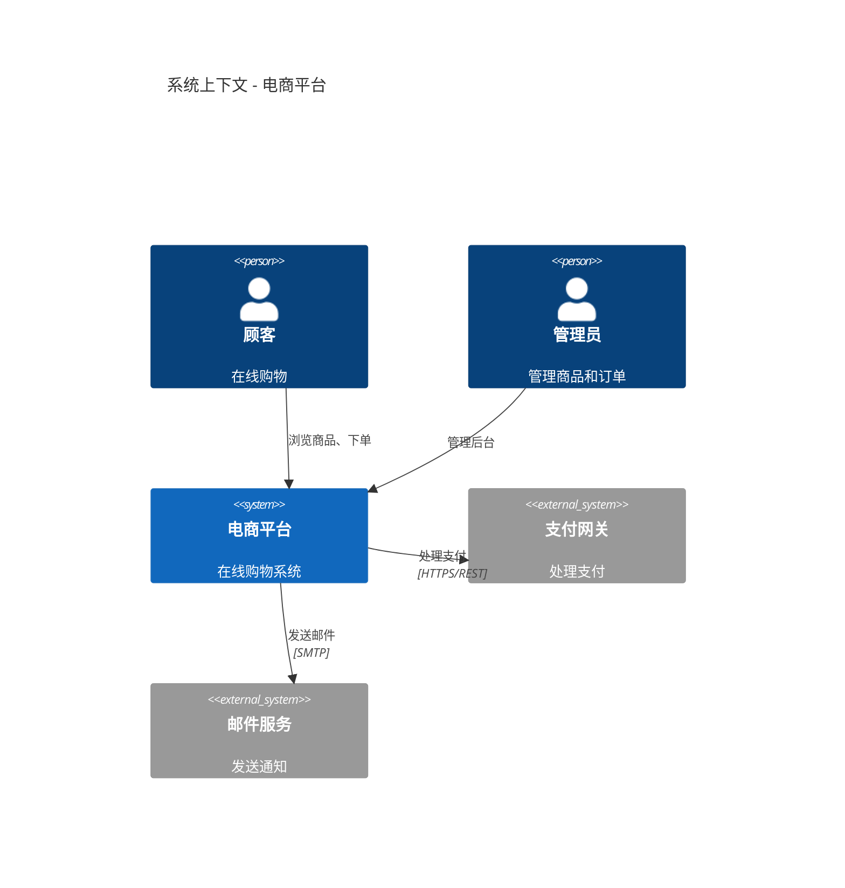

### 容器图

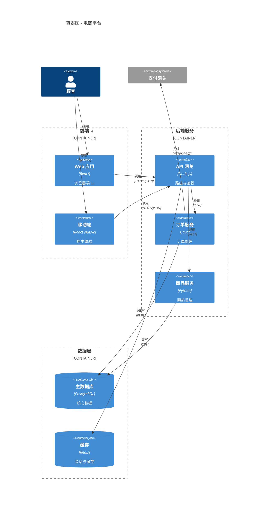

## 代码高亮

除了 Mermaid，zdoc 也支持常规代码高亮：

```ts
const sessions = new Map<string, number>();
const hash = sha256(token + secret);
sessions.set(hash, Date.now() + 7 * 24 * 3600 * 1000);
```

```bash
bun run dev
# Local:   http://localhost:5173
```

```json
{
  "title": "我的文档",
  "docsDir": "./docs",
  "password": "hunter2",
  "port": 8888
}
```

## 行内 `code`

正文里一样能 `inline code`，比如 `_meta.yaml` 或者 `const x = 1`。
